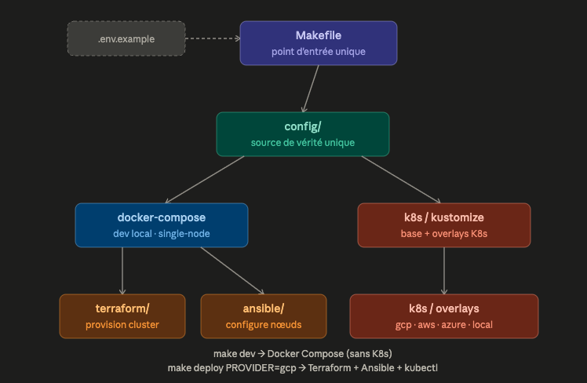
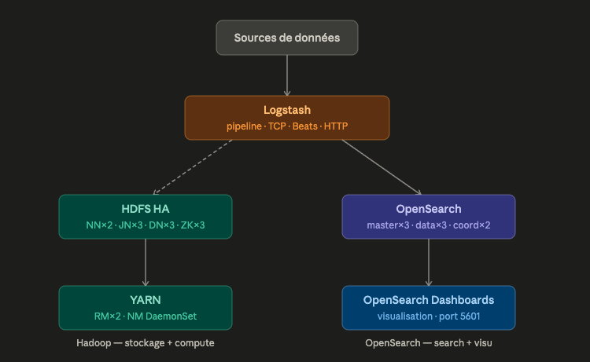
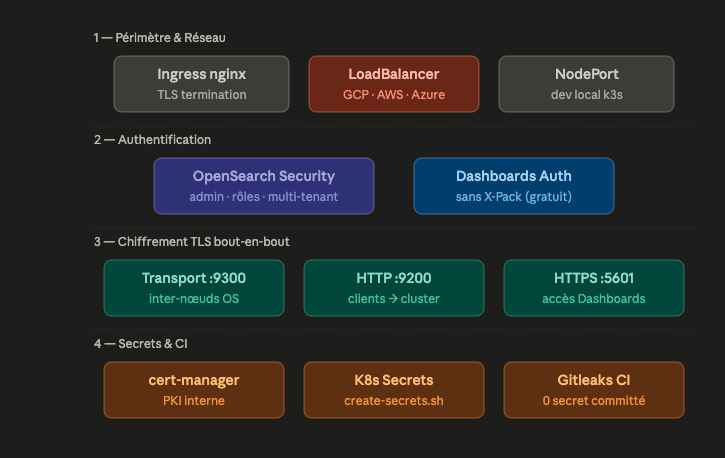

<div align="center">

<br/>


<br/>

# DIAGNOSTIK

### Open-source community Data & AI platform

<br/>

[](https://github.com/Yz23/diagnostik/actions/workflows/ci.yml)
&nbsp;

&nbsp;

&nbsp;

&nbsp;

&nbsp;

&nbsp;

&nbsp;


<br/>

**On-demand ingestion · enrichment · indexing · semantic search · AI-powered exploration**

[What is DIAGNOSTIK](#what-is-diagnostik) · [Quick Start](#quick-start) · [Architecture](#architecture) · [Data pipeline](#data-pipeline) · [Security](#security) · [Docs](#documentation)

<br/>

</div>

---

## What is DIAGNOSTIK?

**DIAGNOSTIK** is an open-source community platform for building Data & AI workflows:

- connect generic data sources through **connectors**
- run reusable **data pipelines** (YAML-driven)
- enrich and normalize documents
- generate embeddings with local or mock providers by default
- index content in **OpenSearch** (text, vector, hybrid search)
- extend the platform through public or **private plugins** (`DIAGNOSTIK_PLUGIN_PATH`)

The public repository is intentionally generic. Private business workflows, proprietary connectors, private datasets, and domain-specific strategies must live outside this repo and be loaded through the plugin system.

### Maturity

| Layer | Status | Notes |
|---|:---:|---|
| **Infrastructure** | Advanced foundation | Docker Compose, Kubernetes, OpenSearch, HDFS HA, YARN HA, Kafka/Spark-ready. |
| **App / API layer** | POC | FastAPI, mock connector, in-memory metadata, mock embeddings, tests. |
| **MVP** | Planned | PostgreSQL metadata, Kafka workers, JWT auth, more connectors, durable indexing. |
| **Production** | Roadmap | OIDC, External Secrets, HA app services, backups, observability, tenant isolation. |

---

## Quick start

### Infrastructure (Docker Compose)

```bash
cp .env.example .env
# Set OPENSEARCH_INITIAL_ADMIN_PASSWORD in .env
make setup        # restore +x on scripts (once after clone)
make dev          # start full stack (OpenSearch · HDFS · YARN · Logstash)
make dev-logs     # follow logs
```

| UI | URL |
|---|---|
| OpenSearch Dashboards | http://localhost:5601 |
| OpenSearch API | http://localhost:9200 |
| HDFS NameNode | http://localhost:9870 |
| YARN ResourceManager | http://localhost:8088 |

### App POC (FastAPI + connectors + search)

```bash
make app-install           # install Python dependencies
make app-dev               # FastAPI on http://127.0.0.1:8000
```

In another shell:

```bash
make app-bootstrap-indexes  # create OpenSearch index templates
make app-ingest-mock        # run mock connector — creates a demo dataset
make app-run-pipeline       # execute default_text_indexing pipeline
make app-search-demo        # text + hybrid search demo
make app-test               # pytest end-to-end
```

Expected result: `/health` returns `{"status":"ok"}`, mock connector creates a dataset, pipeline generates mock embeddings, search returns results.

### Kubernetes (production)

```bash
# Bootstrap remote state (GCS/S3/Azure/HTTP)
PROJECT_ID=my-project REGION=eu-west1 make bootstrap-backend PROVIDER=gcp

# Provision cluster
make provision PROVIDER=gcp

# Configure domain + cert-manager
PROVIDER=gcp DOMAIN=mycompany.com ACME_EMAIL=ops@mycompany.com make configure-domain
make bootstrap-cert-manager ACME_EMAIL=ops@mycompany.com ARGS="--opensearch-pki"

# Create secrets + deploy
export OPENSEARCH_INITIAL_ADMIN_PASSWORD='YourStr0ng!Pass1'
bash scripts/create-secrets.sh
make deploy PROVIDER=gcp
```

---

## Architecture

<div align="center">

</div>

The `Makefile` is the single entry point. Three parallel deployment paths:

| Path | Command | What it starts |
|---|---|---|
| Infrastructure dev | `make dev` | Docker Compose — full stack, single-node |
| App POC | `make app-dev` | FastAPI + Worker + Streamlit, Python in-process |
| Cloud production | `make deploy PROVIDER=gcp` | Terraform + Ansible + kubectl kustomize |

`config/` is the single source of truth — shared between Docker Compose and Kubernetes via `make sync-configs`.

---

## Data pipeline

<div align="center">

</div>

Data flows from external sources through the **connector registry** → **ingestion engine** (normalize, enrich, embed) → **Kafka queue** → **pipeline engine** (YAML templates) → **OpenSearch** (search + embeddings) and **HDFS** (raw storage + compute).

The `mock` connector runs end-to-end today. Other connectors (`file`, `rss`, `api_generic`, `database`, `web_public`) are scaffolds with documented interfaces, ready to implement.

---

## Security

<div align="center">

</div>

| Control | Status | Notes |
|---|:---:|---|
| No secrets in Git | yes | `.env.example` contains empty placeholders only |
| Gitleaks CI | yes | Scans every push and PR |
| OpenSearch auth + RBAC | yes | Built-in security plugin — no X-Pack license |
| TLS end-to-end | yes | cert-manager PKI — `make bootstrap-cert-manager ARGS=--opensearch-pki` |
| Kubernetes NetworkPolicies | yes | Default-deny + allow-list per component |
| HDFS fencing K8s-native | yes | `fence-namenode.sh` + SA + Role + NetworkPolicy |
| API key auth (POC) | yes | `DIAGNOSTIK_AUTH_MODE=api_key` protects write/admin endpoints |
| JWT / OIDC | planned | MVP milestone |
| Remote Terraform state | yes | `make bootstrap-backend PROVIDER=gcp` |

---

## Stack decisions

| Choice | Alternative | Why |
|---|---|---|
| **OpenSearch** | Elasticsearch | Auth, RBAC, TLS built-in — no X-Pack license |
| **HDFS HA** | MinIO / S3 | Native YARN integration for Spark/MapReduce |
| **Kafka KRaft** | ZooKeeper-backed Kafka | Removes extra coordination dependency |
| **Spark on Kubernetes** | Standalone Spark | Atomic jobs, scoped RBAC, clean isolation |
| **Kustomize** | Helm | Plain YAML diffs — no templating language |
| **k3s (local)** | minikube / kind | Lightweight, production-like, runs on Proxmox |
| **FastAPI** | Flask / Django | Async, OpenAPI auto-docs, type-safe with Pydantic |

---

## Public core vs private extensions

The public repository contains: generic API · connector registry · mock connector · data model contracts · pipeline YAML engine · embedding interface · OpenSearch templates · search API · Streamlit POC · plugin SDK.

Private extensions live in a separate repository and are loaded via:

```bash
DIAGNOSTIK_PLUGIN_PATH=/path/to/private/plugins make app-dev
```

See [docs/PRIVATE_USECASES.md](docs/PRIVATE_USECASES.md).

---

## Multi-provider support

| Provider | Engine | Terraform module | StorageClass |
|:---:|:---:|---|:---:|
| GCP | GKE | `modules/gcp-gke` | `premium-rwo` |
| AWS | EKS | `modules/aws-eks` | `gp3` |
| Azure | AKS | `modules/azure-aks` | `managed-premium` |
| Local / Proxmox | k3s | `modules/local-k3s` | `local-path` |

The `k8s/base/` layer is 100% provider-agnostic. Kustomize overlays patch only `StorageClass` and resource limits for local dev.

---

## Repository map

```
apps/
  api/                 FastAPI POC (REST · connectors · pipelines · search)
  worker/              async worker scaffold
  ui/                  Streamlit POC exploration
libs/
  diagnostik_common/   shared models · connectors · pipeline · search
connectors/
  mock/                working end-to-end demo connector
  file/ rss/ api_generic/ database/ web_public/   documented scaffolds
plugins/
  sdk/                 plugin extension contracts
  examples/            safe public examples
  private/             placeholder (not committed — external repo)
pipelines/
  templates/           YAML pipelines (indexing · embeddings · hybrid)
config/
  schemas/             JSON schemas (connector · dataset · document · pipeline)
  opensearch/          index templates
  logstash/ kafka/ spark/   service configurations
docker/
  docker-compose.yml         infrastructure dev stack
  docker-compose.apps.yml    app POC stack
k8s/
  base/                provider-agnostic manifests
  overlays/            local · GCP · AWS · Azure
terraform/
  modules/             gcp-gke · aws-eks · azure-aks · local-k3s
ansible/
  roles/ playbooks/ inventories/
scripts/
  lib/common.sh        shared lib (providers · validation · helpers)
  bootstrap-backend.sh · bootstrap-cert-manager.sh · configure-domain.sh
  deploy.sh · create-secrets.sh · generate-certs-dev.sh
docs/
  ARCHITECTURE · CONNECTORS · DATA_MODEL · PIPELINES
  PLUGIN_SDK · PRIVATE_USECASES · PRODUCTION_READINESS
  SECURITY_MODEL · PRODUCT_POSITIONING · ROADMAP
  starter_guide.docx
```

---

## Getting started — Kubernetes

### Prerequisites

| Tool | Version | Install |
|---|---|---|
| `kubectl` | >= 1.28 | [docs](https://kubernetes.io/docs/tasks/tools/) |
| `terraform` | >= 1.7 | [docs](https://developer.hashicorp.com/terraform/install) |
| `kustomize` | >= 5.4 | [docs](https://kubectl.docs.kubernetes.io/installation/kustomize/) |
| `ansible` | >= 2.16 | `pip install ansible` |
| `python` | >= 3.11 | [docs](https://www.python.org/) |
| Cloud CLI | latest | `gcloud` / `aws` / `az` |

<details>
<summary><b>Local / Proxmox (k3s via Ansible)</b></summary>

```bash
cd ansible/
ansible-galaxy collection install -r requirements.yml
# Edit inventories/proxmox/hosts.yml with your VM IPs
ansible-playbook -i inventories/proxmox/ playbooks/00-preflight.yml
ansible-playbook -i inventories/proxmox/ playbooks/01-base-setup.yml
ansible-playbook -i inventories/proxmox/ playbooks/02-k3s-cluster.yml
```
</details>

### Verify the deployment

```bash
kubectl -n data-platform get pods -o wide

# OpenSearch cluster health (TLS)
kubectl -n data-platform port-forward svc/opensearch 9200:9200 &
curl -u admin:$OPENSEARCH_INITIAL_ADMIN_PASSWORD \
     https://localhost:9200/_cluster/health?pretty -k

# HDFS — which NameNode is active?
kubectl -n data-platform exec hdfs-namenode-0 -- hdfs haadmin -getServiceState nn0
```

---

## Local dev vs production

| | Docker Compose (dev) | Kubernetes (prod) |
|---|---|---|
| OpenSearch | 1 node, single-node | 3 master + 3 data + 2 coord |
| HDFS | 1 NameNode, replication=1 | 2 NameNodes HA + 3 JN |
| YARN | 1 ResourceManager | 2 RM HA + DaemonSet NM |
| JVM heap | 512 MB | 1–4 GB per role |
| TLS | disabled | cert-manager PKI |
| Auth | none | OpenSearch Security + API key |

---

## Operations

```bash
# Scale data nodes
kubectl -n data-platform scale statefulset opensearch-data --replicas=5
kubectl -n data-platform scale statefulset hdfs-datanode --replicas=5

# Rolling upgrade
kubectl -n data-platform set image statefulset/opensearch-data \
  opensearch=opensearchproject/opensearch:2.18.0
kubectl -n data-platform rollout status statefulset/opensearch-data --timeout=300s

# HDFS health
kubectl -n data-platform exec hdfs-namenode-0 -- hdfs dfsadmin -report

# Sync configs after editing config/logstash/ or scripts/fence-namenode.sh
make sync-configs
```

---

## CI/CD

| Job | Tool | What it checks |
|---|---|---|
| `secret-scan` | Gitleaks | No secrets in git history |
| `no-hardcoded-secrets` | grep | No weak passwords in YAML/scripts |
| `shellcheck` | ShellCheck | All bash scripts syntactically valid |
| `kube-validate` | kubeconform | All manifests valid — Kubernetes 1.30 |
| `kustomize-build` | kustomize | All 4 overlays build without errors |
| `terraform-validate` | Terraform | `fmt -check` + `validate` on 4 modules |
| `checksums-validate` | bash | Ansible SHA256 checksums present and distinct |
| `domain-placeholder-check` | grep | No hardcoded domain in Ingress base |
| `trivy-scan` | Trivy | CVE CRITICAL/HIGH on 5 Docker images |

Python app CI (on `apps/` changes): `ruff` · `mypy` · `pytest` · `pip-audit` · `bandit`

---

## Roadmap

See [docs/ROADMAP.md](docs/ROADMAP.md) for full milestones.

- **POC (current)** — mock connector demo, in-memory runtime, API key auth, pytest, plugin SDK.
- **MVP (planned)** — PostgreSQL metadata, Kafka workers, JWT, file/RSS connectors, durable indexing.
- **Production (roadmap)** — OIDC, External Secrets, HA app services, observability, tenant isolation.

---

## Documentation

| Document | Description |
|---|---|
| [Product Positioning](docs/PRODUCT_POSITIONING.md) | Community platform scope |
| [Architecture](docs/ARCHITECTURE_COMMUNITY_PLATFORM.md) | Components and design decisions |
| [Data Model](docs/DATA_MODEL.md) | Workspace, dataset, document, embedding |
| [Connectors](docs/CONNECTORS.md) | How to implement a connector |
| [Pipelines](docs/PIPELINES.md) | YAML pipeline templates reference |
| [Plugin SDK](docs/PLUGIN_SDK.md) | Build and load private plugins |
| [Private Use Cases](docs/PRIVATE_USECASES.md) | What belongs outside this repo |
| [Security Model](docs/SECURITY_MODEL.md) | Auth, TLS, secrets, CI controls |
| [Production Readiness](docs/PRODUCTION_READINESS.md) | Checklist before going to production |
| [Roadmap](docs/ROADMAP.md) | POC / MVP / Production milestones |
| [Local Dev](docs/LOCAL_DEV.md) | Docker Compose and app POC setup |
| [Starter guide](docs/starter_guide.docx) | Beginner guide — Kubernetes, OpenSearch, Hadoop, Terraform |
| [Ansible](ansible/README.md) | Playbooks and inventory setup |
| [Docker](docker/README.md) | Local dev stack guide |

---

## Contributing

1. Fork and branch: `git checkout -b feat/my-feature`
2. Validate: `make validate` · `make app-test`
3. Push and open a PR — all CI jobs must pass

See [docs/CONTRIBUTING.md](docs/CONTRIBUTING.md).

---

<div align="center">

<br/>


**Search at scale. Built open.**

OpenSearch · Apache Hadoop · Kubernetes · Terraform · Ansible · FastAPI

<br/>


<br/>

</div>
