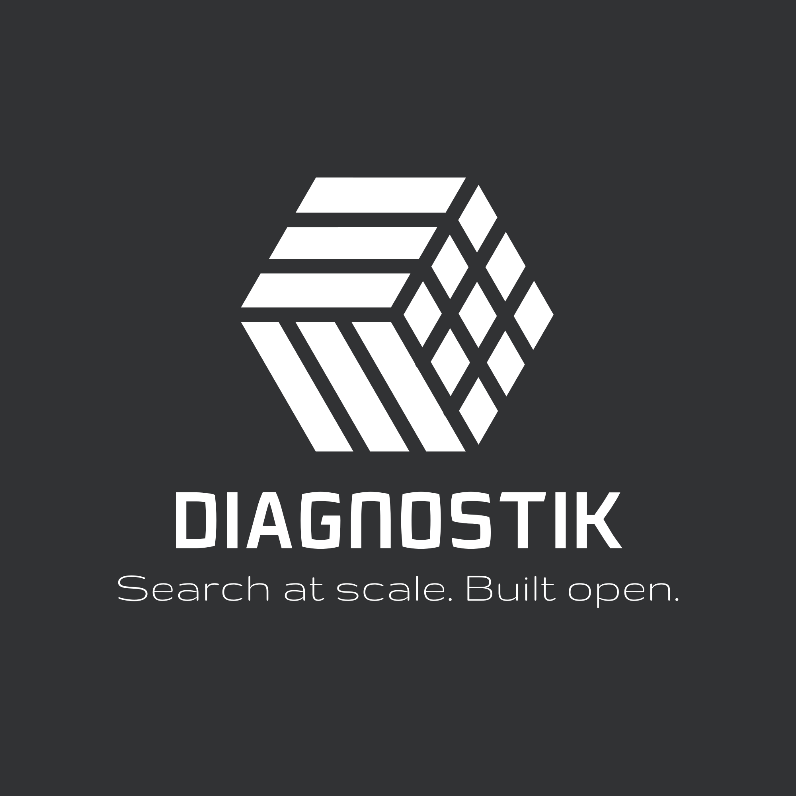

<div align="center">



# DIAGNOSTIK

### Open-source community Data & AI platform

[](https://github.com/Yz23/diagnostik/actions/workflows/ci.yml)


**On-demand ingestion · enrichment · indexing · semantic search · AI-powered exploration**

</div>

---

## What Is Diagnostik?

Diagnostik is an open-source community platform for building Data & AI workflows:

- connect generic data sources through connectors;
- import files and public feeds;
- run reusable data pipelines;
- enrich and normalize documents;
- generate embeddings with local or mock providers by default;
- index content in OpenSearch;
- search with text, vector, or hybrid retrieval;
- extend the platform through public or private plugins.

The public repository is intentionally generic. Private business workflows, proprietary connectors, private datasets, and domain-specific strategies must live outside this repo and be loaded through the plugin system.

## Maturity

| Layer | Current status | Notes |
|---|---|---|
| Infrastructure | Advanced foundation | Docker Compose, Kubernetes, OpenSearch, Kafka/Spark-ready manifests. |
| App/API layer | POC | FastAPI, mock connector, in-memory metadata, mock embeddings, tests. |
| MVP | Planned | PostgreSQL metadata, Kafka workers, auth, more connectors, durable indexing. |
| Production | Roadmap | OIDC, External Secrets, HA app services, backups, observability, tenant isolation. |

The current app layer is a community POC designed to validate architecture, developer experience, and extension points. Production readiness is tracked separately in the roadmap.

## Public Core vs Private Extensions

### Public Core

The public core contains:

- generic API;
- connector registry;
- mock connector;
- data model contracts;
- pipeline YAML engine;
- embedding provider interface;
- OpenSearch templates;
- search API;
- Streamlit POC UI;
- plugin SDK;
- security and roadmap documentation.

### Private Extensions

Private extensions are not included in this repository. They should live in a separate private repository and be loaded with:

```bash
DIAGNOSTIK_PLUGIN_PATH=/path/to/private/plugins
```

Do not commit private datasets, secrets, proprietary configs, or private connector implementations to this public repository.

## Architecture

```text
User / Community UI / API
  -> Workspace Manager
  -> Connector Registry
  -> Ingestion Engine
  -> Kafka / Queue
  -> Pipeline Engine
  -> Storage Layer
  -> AI Enrichment
  -> Embedding Engine
  -> OpenSearch / Vector Search
  -> Search API
  -> Exploration UI
```

## Quick Start: App POC

```bash
cp .env.example .env
make app-install
make app-dev
```

In another shell:

```bash
make app-bootstrap-indexes
make app-ingest-mock
make app-run-pipeline
make app-search-demo
make app-test
```

Expected POC result:

- FastAPI is available on `http://127.0.0.1:8000`;
- `/health` returns `{"status":"ok"}`;
- mock connector creates a demo dataset;
- default pipeline creates mock embeddings;
- text and hybrid search return results.

## Repository Map

```text
apps/
  api/                 FastAPI POC
  worker/              async worker scaffold
  ui/                  Streamlit POC
libs/
  diagnostik_common/   shared models, connectors, pipeline, search
connectors/
  mock/                working public demo connector
  file/                scaffold
  api_generic/         scaffold
  rss/                 scaffold
  database/            scaffold
  web_public/          compliant public web adapter scaffold
plugins/
  sdk/                 plugin SDK
  examples/            safe public examples
  private/             reserved local placeholder
pipelines/
  templates/           reusable YAML pipelines
config/
  schemas/             JSON schemas
  opensearch/          index templates
docker/
  docker-compose.yml       infrastructure dev stack
  docker-compose.apps.yml  app POC stack
k8s/
  base/                provider-agnostic manifests
  overlays/            local, GCP, AWS, Azure
docs/
  *.md                 product, architecture, security, roadmap
```

## Connectors

Public connectors must be generic, documented, rate-limited, and safe for community use.

Current public connector scope:

- `mock`: synthetic demo documents;
- `file`: local files such as CSV, JSON, JSONL, TXT, Markdown;
- `api_generic`: simple HTTP APIs;
- `rss`: public RSS feeds;
- `database`: read-only database ingestion scaffold;
- `web_public`: robots.txt-aware public web adapter scaffold.

## Security Defaults

- No real secrets in Git.
- `.env.example` contains empty placeholders only.
- API key mode is available for POC; JWT/OIDC is planned for MVP.
- `DIAGNOSTIK_AUTH_MODE=api_key` requires `DIAGNOSTIK_API_KEY` and protects write/admin endpoints.
- `DIAGNOSTIK_RUNTIME=memory` is the supported POC runtime; `opensearch` and `postgres` are explicit extension contracts for MVP backends.
- External AI providers are disabled by default.
- Mock/local embedding providers are the default path.
- Private plugins are loaded only from explicit paths.
- JSON logs and audit-oriented fields are defined.

## Documentation

- [Product Positioning](docs/PRODUCT_POSITIONING.md)
- [Architecture](docs/ARCHITECTURE_COMMUNITY_PLATFORM.md)
- [Data Model](docs/DATA_MODEL.md)
- [Connectors](docs/CONNECTORS.md)
- [Pipelines](docs/PIPELINES.md)
- [Plugin SDK](docs/PLUGIN_SDK.md)
- [Private Use Cases](docs/PRIVATE_USECASES.md)
- [Security Model](docs/SECURITY_MODEL.md)
- [Roadmap](docs/ROADMAP.md)

## License

Apache 2.0.
